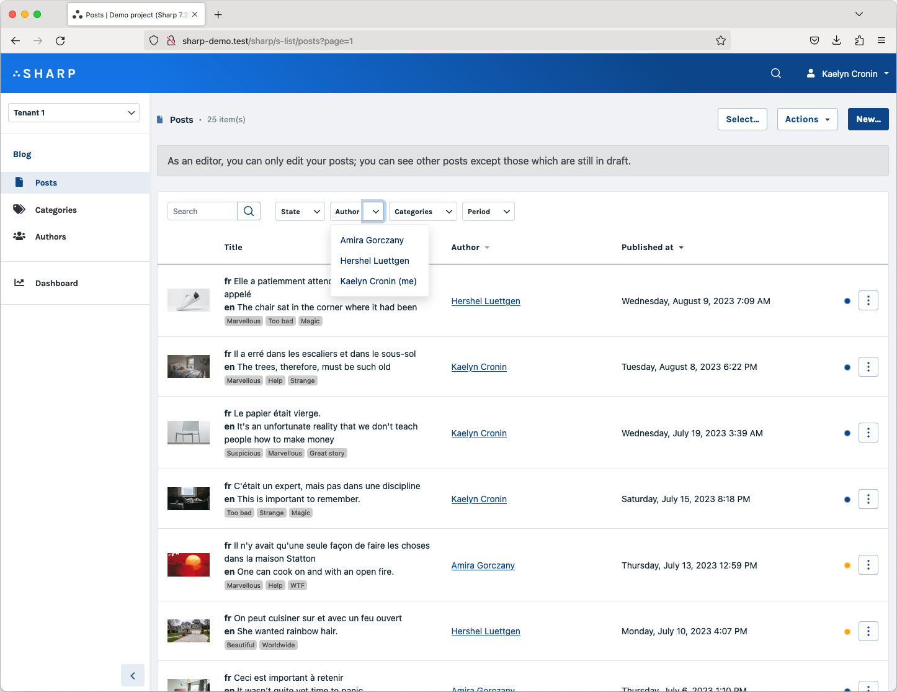
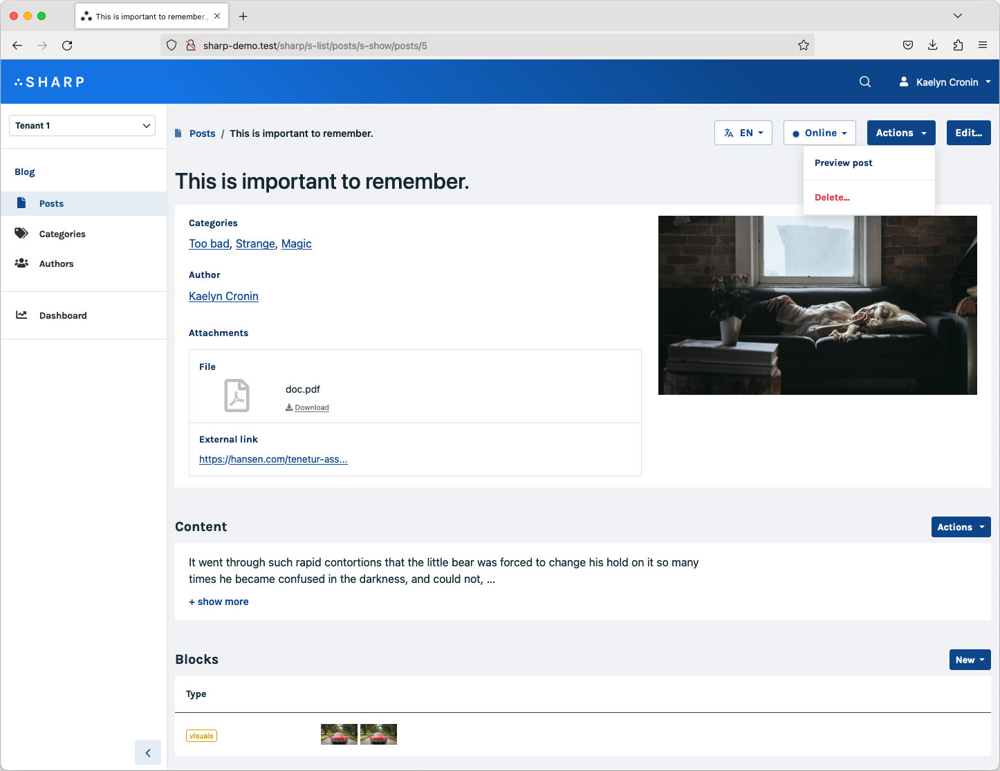
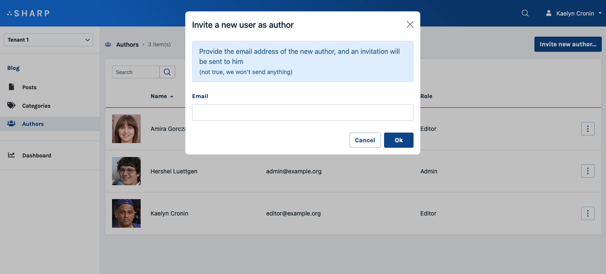
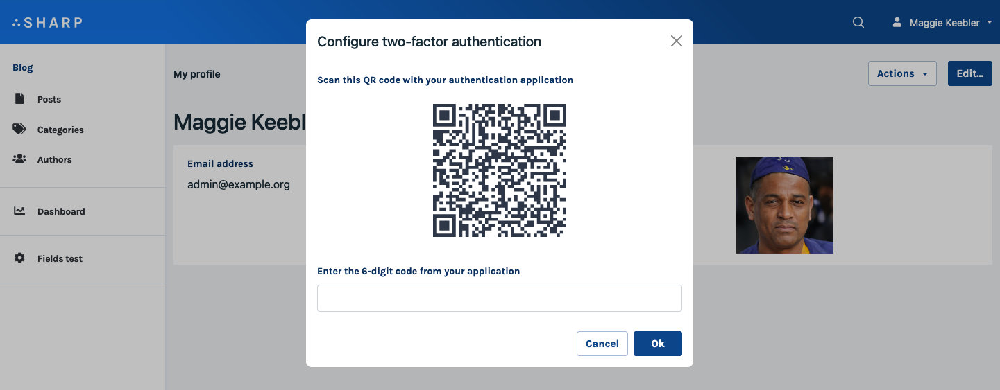
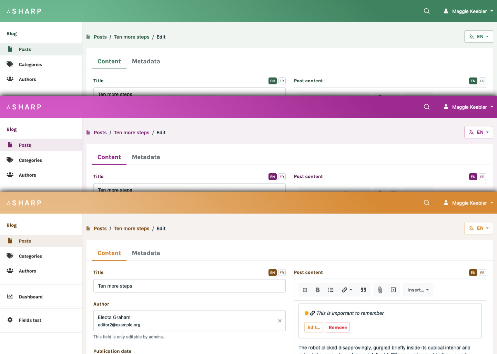

Sharp is a content management framework built for Laravel, a toolset which provides help to build a CMS section in a website, with some rules in mind:
- the public website **should not have any knowledge of the CMS** — the CMS is a part of the system, not the center of it. In fact, removing the CMS should not have any effect on the project.
- Content administrators **should work with their data and terminology**, not CMS terms. I mean, if the project is about spaceships, space travels and pilots, why would the CMS talk about articles, categories and tags?
- Developers **should not have to work on the front-end development for the CMS**. Because life is complicated enough, Sharp takes care of all the responsive / CSS / JS stuff.
- The CMS **should not have any expectations from the persistence layer**: MySQL is cool — but it's not the perfect tool for every problem. And more important, the DB structure has nothing to do with the CMS.

### Build complex lists with total control on how the data is presented

### Organize forms withs various fields, a customizable layout system and data validation

You will find a powerful HTML / Markdown editor, autocompletes with templates, lists (repeaters) with custom items, files with bulk upload and image transformation...

### Optionally create show pages for your resources

You can use show page to present an instance and directly embed in it lists for linked data. The breadcrumb will help your users to find their way up.

### Add filters, sortable columns and global search to your lists

Filters could be defined required or not, allowing multiple values or not, or presented as a date range. 

### Code individual or bulk commands, with dedicated forms, user confirmation...

A Command is an action presented to the user (with permissions handled via policies, like everywhere in Sharp) which can lead to refreshing data after update, previewing a public page, downloading a file...

### Present synthetic data, graphs and direct links in dashboards

### Built-in authentication system, with out-of-the-box 2fa

The optional authentication system provides standard features like remember me token and rate limiting, and you can leverage double authentication with a verification based on a notification or on TOTP.

### Choose your theme color!

Choose one color, and the UI will adapt itself.

### Driven by code, with DX in mind

Everything in Sharp is manageable through a clean and documented PHP API, using Laravel conventions and coding style. And again: no frontend development is required.  

### Try the online demo

A Sharp instance for a demo project is available online here: **[sharp.code16.fr/sharp/](http://sharp.code16.fr/sharp/)**. 

(Data of this demo is reset each hour) 
